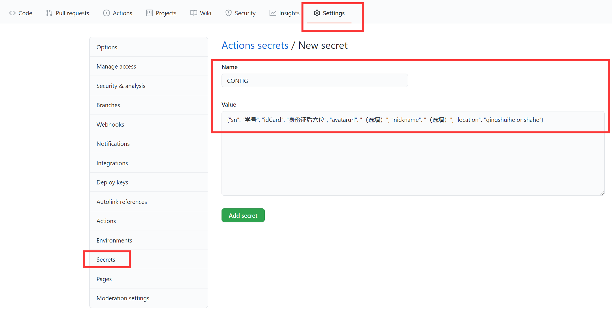

# UESTC 健康打卡平台自动打卡脚本

**由于学校关闭了打卡小程序账号+密码的登录方式，改为统一使用 https://idas.uestc.edu.cn/ 认证，原有的打卡脚本失效。**

[](https://github.com/lyh543/UESTC-ncov-AutoReport/actions/workflows/report.yml)

[](https://opensource.org/licenses/MIT)
<!-- 
 -->

## 说明

1. 本打卡脚本仅供学习交流使用。
2. 开发者对使用本脚本造成的问题不负任何责任。
3. 本脚本运行前需要从手机退出打卡小程序，**且可能导致无法登陆小程序正常打卡**，使用者应当熟悉 `request`、`cookie` 相关知识并有 debug 能力，开发者原则上不提供任何技术支持。

## 更新记录

暂无更新。

## 使用方法 (GitHub Actions)

0. **写在前面：请在自己 Fork 的仓库中修改，并 Rush 到自己的仓库，不要直接修改本仓库，也不要将您的修改 Pull Request 到本仓库（对本仓库的改进除外）！如果尚不了解 GitHub 的基本使用方法，请参阅 [使用议题和拉取请求进行协作/使用复刻](https://docs.github.com/cn/github/collaborating-with-issues-and-pull-requests/working-with-forks) 和 [使用议题和拉取请求进行协作/通过拉取请求提议工作更改](https://docs.github.com/cn/github/collaborating-with-issues-and-pull-requests/proposing-changes-to-your-work-with-pull-requests)。**

1. 从微信小程序退出登录。
2. 将本代码仓库 Fork 到自己的 GitHub。
3. 点击 Actions选项卡，点击 `I understand my workflows, go ahead and enable them`.
4. 点击 Settings 选项卡，点击左侧 Secrets，点击 New Secret，创建一个 Secret 名为 `CONFIG`，值如下（替换为自己的信息）：

```
{"sn": "学号", "idCard": "身份证后六位", "avatarurl": "头像链接（选填）", "nickname": "微信昵称（选填）", "location": "地址（选填）"}
```

其中 `location` 的值可以自定义（亦可不填），以下提供几个参考：
* 清水河：`四川省郫都区S9`

  


5. 默认的打卡时间是每天的早上 9:30，如需选择其它时间，可以修改 `.github/workflows/report.yml` 中的 `cron`，详细说明参见[安排的事件](https://docs.github.com/cn/actions/reference/events-that-trigger-workflows#scheduled-events)，请注意这里使用的是**国际标准时间 UTC**，北京时间的数值比它大 8 个小时。建议修改默认时间，避开打卡高峰期以提高成功率。
6. 在 Actions 选项卡可以确认打卡情况。如果打卡失败（可能是临时网络问题等原因），脚本会自动重试，五次尝试后如果依然失败，将返回非零值提示打卡失败。
7. 在 GitHub 个人设置页面的 Notifications 下可以设置 Github Actions 的通知，建议打开 Email 通知，并勾选 `Send notifications for failed workflows only`。

## 本地测试方法

要在本地运行测试，需要安装 Python 3。我们假设您已经安装了 Python 3 和 pip3，并已将其路径添加到环境变量。

### 安装依赖

```shell
pip install -r requirements.txt
```

### 创建 `config.py`

将 `config.template.py` 复制并重命名为 `config.py`，然后根据自己的信息进行修改。

### 运行打卡程序

运行前同样需从微信小程序退出登录。

```shell
python report.py
```

## 无法登陆小程序

这可能是由于 GitHub Actions 成功登陆，但退出失败，导致小程序无法登陆。请查询 GitHub Actions 中成功登陆的 Session id，然后手动退出。可以在项目根目录运行 python 执行以下代码退出登陆：

```py
from report import Report
auto_report = Report()
auto_report.session.cookies['JSESSIONID'] = 'Your Session id'
auto_report.logout()
```

如果仍无法登录小程序，请联系辅导员/管理员。
